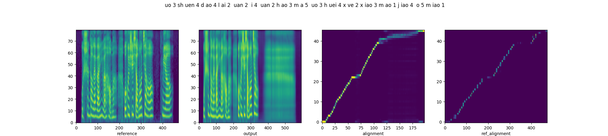
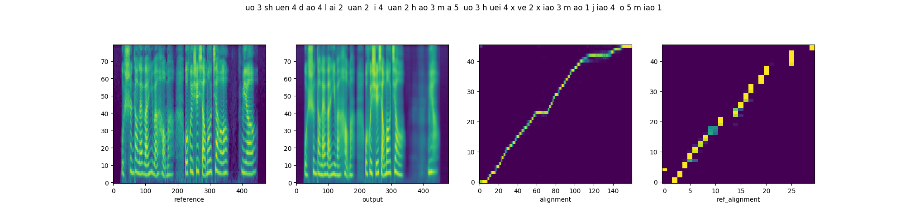
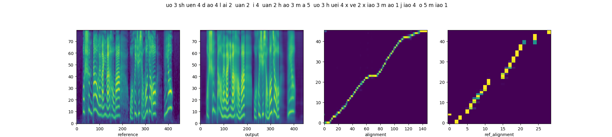
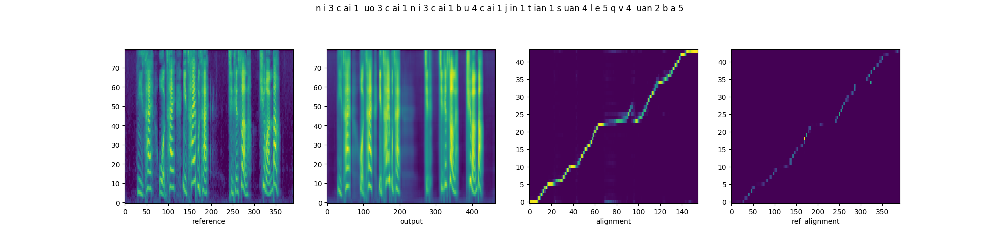
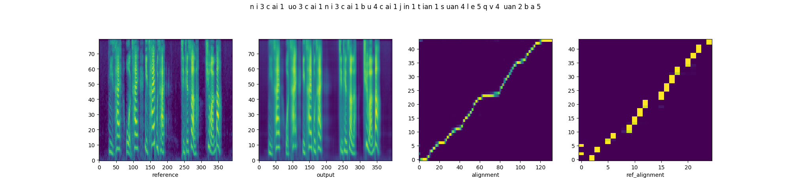
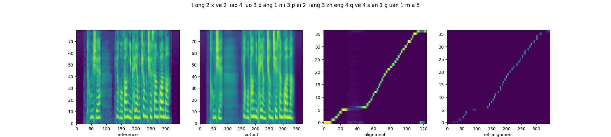
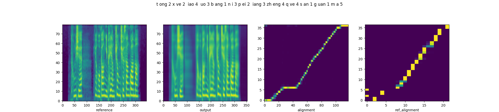
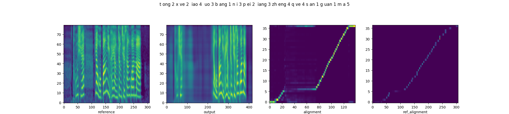
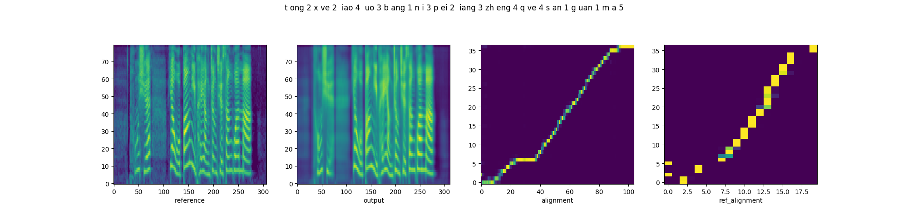

## Abstract

This paper introduces a multi-scale speech style modeling method for end-to-end expressive speech synthesis. 
The proposed method employs a multi-scale reference encoder to extract both the global-scale utterance-level and the local-scale quasi-phoneme-level style features of the target speech, which are then fed into the speech synthesis model as an extension to the input phoneme sequence. 
During training time, the multi-scale style model could be jointly trained with the speech synthesis model in an end-to-end fashion. 
By applying the proposed method to style transfer task, experimental results indicate that the controllability of the multi-scale speech style model and the expressiveness of the synthesized speech are greatly improved. 
Moreover, by assigning different reference speeches to extraction of style on each scale, the flexibility of the proposed method is further revealed.

## Multi-scale Style Transfer

## Quasi-phoneme-scale v.s. Frame-scale

### Sample1

**Reference Audio**
| Audio | Chinese Text | Emotion |
| :---- | :---- | :---- |
| <audio controls><source src="./static/qvsf/ref/case1.wav" type="audio/wav">Your browser does not support the audio element.</audio> | 我顺道来玩一玩好吗？我会学小猫叫哦，喵 | Sad |

**Result**
| System | Plot result | Synthesized Audio |
|:------------|:------------|:------------|
| Base-FS |  | <audio controls><source src="./static/qvsf/basefs/case1.wav" type="audio/wav">Your browser does not support the audio element.</audio> |
| Proposed |  | <audio controls><source src="./static/qvsf/proposed/case1.wav" type="audio/wav">Your browser does not support the audio element.</audio> |

### Sample2

**Reference Audio**
| Audio | Chinese Text | Emotion |
| :---- | :---- | :---- |
| <audio controls><source src="./static/qvsf/ref/case2.wav" type="audio/wav">Your browser does not support the audio element.</audio> | 我顺道来玩一玩好吗？我会学小猫叫哦，喵 | Surprised |

**Result**
| System | Plot result | Synthesized Audio |
|:------------|:------------|:------------|
| Base-FS |  | <audio controls><source src="./static/qvsf/basefs/case2.wav" type="audio/wav">Your browser does not support the audio element.</audio> |
| Proposed |  | <audio controls><source src="./static/qvsf/proposed/case2.wav" type="audio/wav">Your browser does not support the audio element.</audio> |

### Sample3

**Reference Audio**
| Audio | Chinese Text | Emotion |
| :---- | :---- | :---- |
| <audio controls><source src="./static/qvsf/ref/case3.wav" type="audio/wav">Your browser does not support the audio element.</audio> | 你猜我猜你猜不猜，今天算了，去玩吧 | Angry |

**Result**
| System | Plot result | Synthesized Audio |
|:------------|:------------|:------------|
| Base-FS |  | <audio controls><source src="./static/qvsf/basefs/case3.wav" type="audio/wav">Your browser does not support the audio element.</audio> |
| Proposed |  | <audio controls><source src="./static/qvsf/proposed/case3.wav" type="audio/wav">Your browser does not support the audio element.</audio> |

### Sample4

**Reference Audio**
| Audio | Chinese Text | Emotion |
| :---- | :---- | :---- |
| <audio controls><source src="./static/qvsf/ref/case4.wav" type="audio/wav">Your browser does not support the audio element.</audio> | 同学，要我帮你培养正确三观吗？ | Fear |

**Result**
| System | Plot result | Synthesized Audio |
|:------------|:------------|:------------|
| Base-FS |  | <audio controls><source src="./static/qvsf/basefs/case4.wav" type="audio/wav">Your browser does not support the audio element.</audio> |
| Proposed |  | <audio controls><source src="./static/qvsf/proposed/case4.wav" type="audio/wav">Your browser does not support the audio element.</audio> |

### Sample5

**Reference Audio**
| Audio | Chinese Text | Emotion |
| :---- | :---- | :---- |
| <audio controls><source src="./static/qvsf/ref/case5.wav" type="audio/wav">Your browser does not support the audio element.</audio> | 同学，要我帮你培养正确三观吗？ | Surprised |

**Result**
| System | Plot result | Synthesized Audio |
|:------------|:------------|:------------|
| Base-FS |  | <audio controls><source src="./static/qvsf/basefs/case5.wav" type="audio/wav">Your browser does not support the audio element.</audio> |
| Proposed |  | <audio controls><source src="./static/qvsf/proposed/case5.wav" type="audio/wav">Your browser does not support the audio element.</audio> |

## Multi-reference Style Transfer