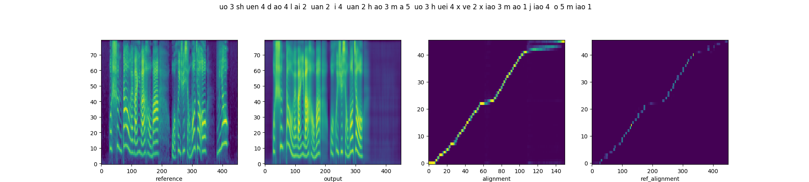

## Abstract

This paper introduces a multi-scale speech style modeling method for end-to-end expressive speech synthesis. 
The proposed method employs a multi-scale reference encoder to extract both the global-scale utterance-level and the local-scale quasi-phoneme-level style features of the target speech, which are then fed into the speech synthesis model as an extension to the input phoneme sequence. 
During training time, the multi-scale style model could be jointly trained with the speech synthesis model in an end-to-end fashion. 
By applying the proposed method to style transfer task, experimental results indicate that the controllability of the multi-scale speech style model and the expressiveness of the synthesized speech are greatly improved. 
Moreover, by assigning different reference speeches to extraction of style on each scale, the flexibility of the proposed method is further revealed.

## Multi-scale Style Transfer

To demonstrate the influence of global-scale style embedding (**GSE**) and local-scale prosody embedding (**LPE**) in our proposed multi-scale speech style modeling method, the parallel style transfer results of **Base-G**, **Base-L**, and proposed model are provided here for comparison.

| Reference Audio | Emotion | Chinese Text | Synthesized (**Base-L**) | Synthesized (**Base-G**) | Synthesized (**Proposed**) |
| :---- | :---- | :---- | :---- | :---- | :---- |
| <audio controls><source src="./static/msst/ref/case1.wav" type="audio/wav">Your browser does not support the audio element.</audio> | Neutral | 但是如今大部分的跨洋货运还是靠轮船 | <audio controls><source src="./static/msst/basel/case1.wav" type="audio/wav">Your browser does not support the audio element.</audio> | <audio controls><source src="./static/msst/baseg/case1.wav" type="audio/wav">Your browser does not support the audio element.</audio> | <audio controls><source src="./static/msst/proposed/case1.wav" type="audio/wav">Your browser does not support the audio element.</audio> |
| <audio controls><source src="./static/msst/ref/case2.wav" type="audio/wav">Your browser does not support the audio element.</audio> | Angry | 但是如今大部分的跨洋货运还是靠轮船 | <audio controls><source src="./static/msst/basel/case2.wav" type="audio/wav">Your browser does not support the audio element.</audio> | <audio controls><source src="./static/msst/baseg/case2.wav" type="audio/wav">Your browser does not support the audio element.</audio> | <audio controls><source src="./static/msst/proposed/case2.wav" type="audio/wav">Your browser does not support the audio element.</audio> |
| <audio controls><source src="./static/msst/ref/case3.wav" type="audio/wav">Your browser does not support the audio element.</audio> | Fear | 但是如今大部分的跨洋货运还是靠轮船 | <audio controls><source src="./static/msst/basel/case3.wav" type="audio/wav">Your browser does not support the audio element.</audio> | <audio controls><source src="./static/msst/baseg/case3.wav" type="audio/wav">Your browser does not support the audio element.</audio> | <audio controls><source src="./static/msst/proposed/case3.wav" type="audio/wav">Your browser does not support the audio element.</audio> |
| <audio controls><source src="./static/msst/ref/case4.wav" type="audio/wav">Your browser does not support the audio element.</audio> | Disgust | 但是如今大部分的跨洋货运还是靠轮船 | <audio controls><source src="./static/msst/basel/case4.wav" type="audio/wav">Your browser does not support the audio element.</audio> | <audio controls><source src="./static/msst/baseg/case4.wav" type="audio/wav">Your browser does not support the audio element.</audio> | <audio controls><source src="./static/msst/proposed/case4.wav" type="audio/wav">Your browser does not support the audio element.</audio> |
| <audio controls><source src="./static/msst/ref/case5.wav" type="audio/wav">Your browser does not support the audio element.</audio> | Happy | 但是如今大部分的跨洋货运还是靠轮船 | <audio controls><source src="./static/msst/basel/case5.wav" type="audio/wav">Your browser does not support the audio element.</audio> | <audio controls><source src="./static/msst/baseg/case5.wav" type="audio/wav">Your browser does not support the audio element.</audio> | <audio controls><source src="./static/msst/proposed/case5.wav" type="audio/wav">Your browser does not support the audio element.</audio> |
| <audio controls><source src="./static/msst/ref/case6.wav" type="audio/wav">Your browser does not support the audio element.</audio> | Sad | 但是如今大部分的跨洋货运还是靠轮船 | <audio controls><source src="./static/msst/basel/case6.wav" type="audio/wav">Your browser does not support the audio element.</audio> | <audio controls><source src="./static/msst/baseg/case6.wav" type="audio/wav">Your browser does not support the audio element.</audio> | <audio controls><source src="./static/msst/proposed/case6.wav" type="audio/wav">Your browser does not support the audio element.</audio> |
| <audio controls><source src="./static/msst/ref/case7.wav" type="audio/wav">Your browser does not support the audio element.</audio> | Surprised | 但是如今大部分的跨洋货运还是靠轮船 | <audio controls><source src="./static/msst/basel/case7.wav" type="audio/wav">Your browser does not support the audio element.</audio> | <audio controls><source src="./static/msst/baseg/case7.wav" type="audio/wav">Your browser does not support the audio element.</audio> | <audio controls><source src="./static/msst/proposed/case7.wav" type="audio/wav">Your browser does not support the audio element.</audio> |

## Multi-reference Style Transfer

This part consists of the multi-reference style transfer results of proposed model, where the proposed model is given two different reference audios each time for the style transfer on global and local scale, respectively. **These two reference audios can have different global emotion style, text content and local prosody style.** The synthesized speech, which shares the same text with the local-scale reference audio, tends to **reproduce the global emotion style of global-scale reference audio**, while **preserves the local prosody style of the local-scale reference**.

| Reference Audio (Global) | Emotion (Global) | Chinese Text (Global) | Reference Audio (Local) | Emotion (Local) | Chinese Text (Local) | Synthesized |
| :---- | :---- | :---- | :---- | :---- | :---- | :---- |
| <audio controls><source src="./static/mrst/refg/case1.wav" type="audio/wav">Your browser does not support the audio element.</audio> | Neutral | 但是如今大部分的跨洋货运还是靠轮船 | <audio controls><source src="./static/mrst/refl/case1.wav" type="audio/wav">Your browser does not support the audio element.</audio> | Sad | 北京周三限行尾号为二和七 | <audio controls><source src="./static/mrst/proposed/case1.wav" type="audio/wav">Your browser does not support the audio element.</audio> |
| <audio controls><source src="./static/mrst/refg/case2.wav" type="audio/wav">Your browser does not support the audio element.</audio> | Neutral | 但是如今大部分的跨洋货运还是靠轮船 | <audio controls><source src="./static/mrst/refl/case2.wav" type="audio/wav">Your browser does not support the audio element.</audio> | Angry | 北京周三限行尾号为二和七 | <audio controls><source src="./static/mrst/proposed/case2.wav" type="audio/wav">Your browser does not support the audio element.</audio> |
| <audio controls><source src="./static/mrst/refg/case3.wav" type="audio/wav">Your browser does not support the audio element.</audio> | Sad | 北京周三限行尾号为二和七 | <audio controls><source src="./static/mrst/refl/case3.wav" type="audio/wav">Your browser does not support the audio element.</audio> | Happy | 但是如今大部分的跨洋货运还是靠轮船 | <audio controls><source src="./static/mrst/proposed/case3.wav" type="audio/wav">Your browser does not support the audio element.</audio> |
| <audio controls><source src="./static/mrst/refg/case4.wav" type="audio/wav">Your browser does not support the audio element.</audio> | Sad | 北京周三限行尾号为二和七 | <audio controls><source src="./static/mrst/refl/case4.wav" type="audio/wav">Your browser does not support the audio element.</audio> | Surprised | 但是如今大部分的跨洋货运还是靠轮船 | <audio controls><source src="./static/mrst/proposed/case4.wav" type="audio/wav">Your browser does not support the audio element.</audio> |
| <audio controls><source src="./static/mrst/refg/case5.wav" type="audio/wav">Your browser does not support the audio element.</audio> | Happy | 但是如今大部分的跨洋货运还是靠轮船 | <audio controls><source src="./static/mrst/refl/case5.wav" type="audio/wav">Your browser does not support the audio element.</audio> | Fear | 哈尔滨明天北风三到四级 | <audio controls><source src="./static/mrst/proposed/case5.wav" type="audio/wav">Your browser does not support the audio element.</audio> |
| <audio controls><source src="./static/mrst/refg/case6.wav" type="audio/wav">Your browser does not support the audio element.</audio> | Happy | 但是如今大部分的跨洋货运还是靠轮船 | <audio controls><source src="./static/mrst/refl/case6.wav" type="audio/wav">Your browser does not support the audio element.</audio> | Disgust | 哈尔滨明天北风三到四级 | <audio controls><source src="./static/mrst/proposed/case6.wav" type="audio/wav">Your browser does not support the audio element.</audio> |

## Quasi-phoneme-scale v.s. Frame-scale

In order to prove that downsampling of fine-grained prosody sequence enhances the robustness of reference attention, we present the parallel style transfer results of Multi-scale Style Models with proposed quasi-phoneme-scale (**proposed**) and frame-scale (**Base-FS**) respectively. From left to right, each diagram includes the spectrograms of the reference and synthesized audios, and the alignments of decoder attention and reference attention. 

### Sample1

**Reference Audio**

| Audio | Chinese Text | Emotion |
| :---- | :---- | :---- |
| <audio controls><source src="./static/qvsf/ref/case1.wav" type="audio/wav">Your browser does not support the audio element.</audio> | 我顺道来玩一玩好吗？我会学小猫叫哦，喵 | Sad |

**Result**

| System | Plot result | Synthesized Audio |
|:------------|:------------|:------------|
| Base-FS |  | <audio controls><source src="./static/qvsf/basefs/case1.wav" type="audio/wav">Your browser does not support the audio element.</audio> |
| Proposed |  | <audio controls><source src="./static/qvsf/proposed/case1.wav" type="audio/wav">Your browser does not support the audio element.</audio> |

### Sample2

**Reference Audio**

| Audio | Chinese Text | Emotion |
| :---- | :---- | :---- |
| <audio controls><source src="./static/qvsf/ref/case2.wav" type="audio/wav">Your browser does not support the audio element.</audio> | 我顺道来玩一玩好吗？我会学小猫叫哦，喵 | Surprised |

**Result**

| System | Plot result | Synthesized Audio |
|:------------|:------------|:------------|
| Base-FS |  | <audio controls><source src="./static/qvsf/basefs/case2.wav" type="audio/wav">Your browser does not support the audio element.</audio> |
| Proposed |  | <audio controls><source src="./static/qvsf/proposed/case2.wav" type="audio/wav">Your browser does not support the audio element.</audio> |

### Sample3

**Reference Audio**

| Audio | Chinese Text | Emotion |
| :---- | :---- | :---- |
| <audio controls><source src="./static/qvsf/ref/case3.wav" type="audio/wav">Your browser does not support the audio element.</audio> | 你猜我猜你猜不猜，今天算了，去玩吧 | Angry |

**Result**

| System | Plot result | Synthesized Audio |
|:------------|:------------|:------------|
| Base-FS |  | <audio controls><source src="./static/qvsf/basefs/case3.wav" type="audio/wav">Your browser does not support the audio element.</audio> |
| Proposed |  | <audio controls><source src="./static/qvsf/proposed/case3.wav" type="audio/wav">Your browser does not support the audio element.</audio> |

### Sample4

**Reference Audio**

| Audio | Chinese Text | Emotion |
| :---- | :---- | :---- |
| <audio controls><source src="./static/qvsf/ref/case4.wav" type="audio/wav">Your browser does not support the audio element.</audio> | 同学，要我帮你培养正确三观吗？ | Fear |

**Result**

| System | Plot result | Synthesized Audio |
|:------------|:------------|:------------|
| Base-FS |  | <audio controls><source src="./static/qvsf/basefs/case4.wav" type="audio/wav">Your browser does not support the audio element.</audio> |
| Proposed |  | <audio controls><source src="./static/qvsf/proposed/case4.wav" type="audio/wav">Your browser does not support the audio element.</audio> |

### Sample5

**Reference Audio**

| Audio | Chinese Text | Emotion |
| :---- | :---- | :---- |
| <audio controls><source src="./static/qvsf/ref/case5.wav" type="audio/wav">Your browser does not support the audio element.</audio> | 同学，要我帮你培养正确三观吗？ | Surprised |

**Result**

| System | Plot result | Synthesized Audio |
|:------------|:------------|:------------|
| Base-FS |  | <audio controls><source src="./static/qvsf/basefs/case5.wav" type="audio/wav">Your browser does not support the audio element.</audio> |
| Proposed |  | <audio controls><source src="./static/qvsf/proposed/case5.wav" type="audio/wav">Your browser does not support the audio element.</audio> |
